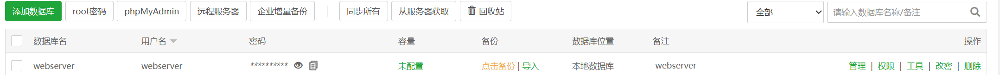
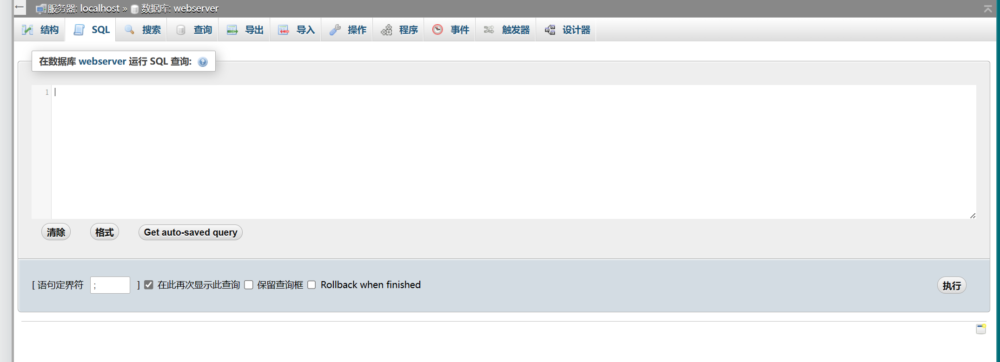
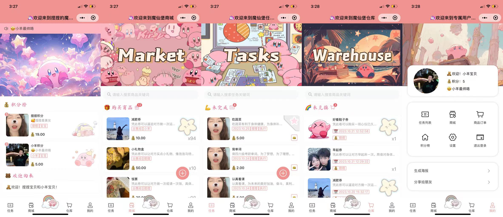
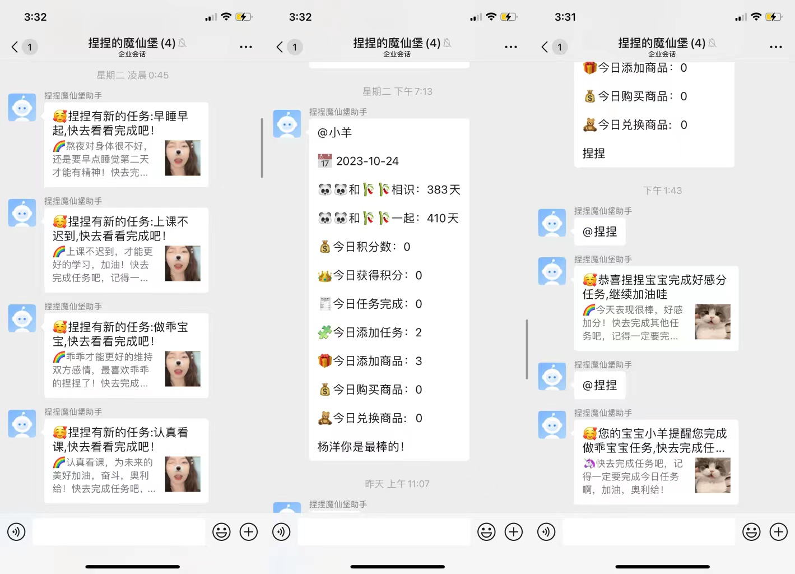
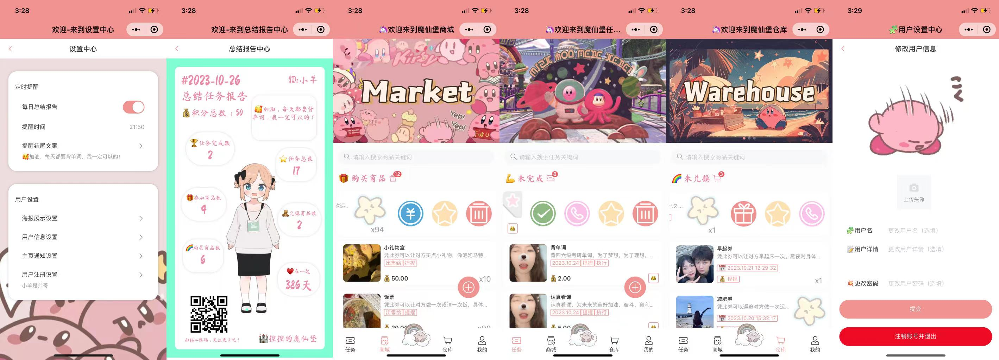

# loveShopping

项目描述：这个项目是基于[Rainbow-Cats-Personal-WeChat-MiniProgram](https://github.com/UxxHans/Rainbow-Cats-Personal-WeChat-MiniProgram)的代码改造而来，转变为网页端应用。它具备多人同时登陆、自定义任务、自定义用户信息、登录、注册、自定义商品和购买商品，自定义提醒等功能,
如果是学生的话，可以申请Azure的免费服务器，项目将完全免费！敲代码不易，请给我一个星星吧！感谢！

## 功能特性

- **多人同时登陆：** 允许多个用户同时访问系统，进行各种操作。

- **自定义任务：** 用户可以创建和管理自己的任务列表，以便更好地组织工作和生活。

- **自定义用户信息：** 提供用户个人信息管理功能，包括头像、昵称、联系信息等。

- **自定义商品：** 允许用户添加、编辑和删除商品信息，以便展示和销售。

- **登录和注册：** 用户可以通过注册账户和登录来访问系统。

- **查看商品，任务，用户信息：** 提供信息查看功能，包括商品、任务、用户信息等。

- **完成删除任务：** 用户可以选择完成自己创建给他人的任务或删除任务。
  
- **购买兑换商品：** 用户可以选择购买系统中的商品，并完成交易流程。

- **丝滑的操作：** 用户体验良好，操作简单

- **可靠使用：** 只有特定的用户才能进行特定用户的操作，保护了用户的使用安全

- **提醒功能：** 接入企业微信实现可以提醒新建任务，和实现通知功能！

- **自定义用户配置：** 实现自定义注册，自定义提醒，自定义海报等！

- **接入企业微信：** 同时可以接入企业微信ChatGpt机器人，可实现更多功能！

- **可玩性高：** 可以扩展更多功能，未来计划扩展聊天室，交换照片，闪照，游戏互动等功能！


缺点：
- 部分手机可能会出现适配问题：毕竟学编程没多久，代码质量不是很行！

- 还没实现电脑端和ipad端

- 没有实现图片分级管理

- 更多功能期待开发

## 部署指南
## 前端部署

1. **打包前端项目：** 使用VSCode或其他编辑器打包前端WebServer项目，并确保您已经生成了前端的`dist`文件。

2. **复制文件到宝塔：** 将`dist`文件夹内的所有文件复制到宝塔服务器的网站根目录。您可以使用FTP工具或SSH将文件上传到服务器。

3. **新建站点：** 使用宝塔面板，在网站管理中新建一个站点。配置站点的域名、根目录等信息，确保站点的根目录指向您上传的`dist`文件夹。

## 后端部署

1. **打包后端项目：**
- 1.使用IntelliJ IDEA或其他Java集成开发环境打包后端项目

- 2.没有idea，直接启动我打包好的包。 [后端启动包](https://github.com/Yanyutin753/SpringBoot-/blob/main/server/target/WebServer-0.0.1-SNAPSHOT.jar)

- 3.用宝塔新建mysql数据库，
数据库名字命名为：webserver
用户名命名为：webserver
用户名密码为= 自己设置

- 4 **运行jar启动包** 
```
nohup java -jar 【 打包好的项目文件名（jar结尾）】> output.log 2>&1 &
或者
nohup java -jar WebServer-0.0.1-SNAPSHOT.jar --spring.datasource.password=(你的数据库密码)> output.log 2>&1 &
tail -f output.log
```

-5.配置mysql数据库表

点击管理

>
点击SQL复制[文件](https://github.com/Yanyutin753/shop-task-forlovers/blob/main/%E6%95%B0%E6%8D%AE%E5%BA%93%E5%88%9B%E5%BB%BAsql.txt)里的内容


>
- 6.可以自行在userTable填写内容，或者打开网页进行注册，添加内容


## [宝塔超级简单部署](https://github.com/Yanyutin753/shop-task-forlovers/simpleDeploy)里的内容
- 详情请点击查看

## [docket部署](https://github.com/Yanyutin753/shop-task-forlovers/Docker-love)
- 详情请点击查看


## 展示内容

## 主页


## 展示页


## 微信通知


## 功能页



## 贡献

如果您有兴趣为项目做出贡献或报告问题，请查看项目的GitHub仓库并提出您的建议和改进。

### 贡献与支持
- 欢迎贡献代码，提出问题和建议。如果你发现了bug或者有新的功能想法，请提交一个Issue让我知道。你也可以通过Fork项目并提交Pull Request来贡献代码。 如果你想部署这个项目，给我一个星星⭐，这是对我最大的支持！
- 可以加我进群，学习更多代码，该网站可以已实现和企业微信互联，实现提醒功能！


- 敲代码不易，希望客官给点赞助，让我更好修改代码！
  


感谢您的兴趣和支持！


感谢您的兴趣和支持！

