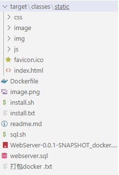

## 不接受白嫖，使用请点star⭐
###### 安装docket
```
sudo apt-get install docker

```
##### 将安装包解压到/www/wwwroot/webServer路径,并把Docker-love里的内容复制到该目录下下，如果更换路径请在脚本中自行替换

##### 运行install.sh 一键安装
```bash
cd /www/wwwroot/webServer
sudo sh install.sh
```
##### 请确保以下条件：

- [x] 目录结构一致

- [x] 8081，3306，你选择的访问服务端口防火墙已开放
- [x] 使用root权限运行该脚本
- [x] 在webserver.sql中修改对应的参数

## 1.在webserver.sql中修改对应的参数

```bash
INSERT INTO `logincheck` (`attribute`, `value`) VALUES
('loginCheck', '小羊是帅哥'),
('wechatNoticeKey', '***********************');
```
wechatNoticeKey获取方法：
###### 1.进入https://work.weixin.qq.com/
点击注册信息随意填写
然后依次点击 我的企业-微信插件-下拉使用微信扫描该二维码。
（注）以上步骤是为了微信能够接受微信企业消息
###### 2.进入手机微信
进入自己新建的企业，新建一个群组。

###### 3.进入手机企业微信
选择新建的企业登录，进入创立的群组-选择右上角三个点-点击群组机器人-点击添加-随意输入名字-得到一个链接：
https://qyapi.weixin.qq.com/cgi-bin/webhook/send?key=05e8b9b2-6be7-4d4b-bbce-54846851b450
拿取（05e8b9b2-6be7-4d4b-bbce-54846851b450）部分 放入wechatNoticeKey

## 2. 访问服务端口设置位于install.sh 文件 38行位置
示例 修改为8888 端口：
```bash
docker run -d -p 8888:8081 \
--name webserver \
--link mysql:db \
-v /export/Logs/WebServer-0.0.1:/export/Logs/WebServer-0.0.1 \
webserver/webserver-0.0.1
echo "启动成功 请打开8888端口查看"
```
## 3. 如遇数据库导入报错

可将以下命令重新执行
```bash
docker exec -i -t mysql /bin/bash -c "/sql.sh"
```
从新执行该命令即可

## 更新：
已将数据库处理代码去除：
待一键运行结束后，再运行以下代码运行，以导入数据库数据。
```bash
docker exec -i -t mysql /bin/bash -c "/sql.sh"
```
